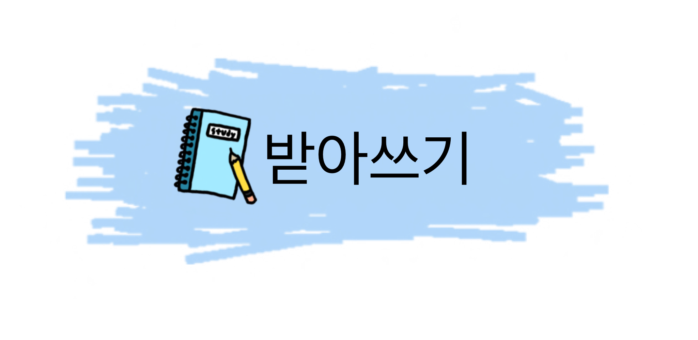

<!--
*** Thanks for checking out the Best-README-Template. If you have a suggestion
*** that would make this better, please fork the repo and create a pull request
*** or simply open an issue with the tag "enhancement".
*** Thanks again! Now go create something AMAZING! :D
-->

<!-- PROJECT SHIELDS -->
<!--
*** I'm using markdown "reference style" links for readability.
*** Reference links are enclosed in brackets [ ] instead of parentheses ( ).
*** See the bottom of this document for the declaration of the reference variables
*** for contributors-url, forks-url, etc. This is an optional, concise syntax you may use.
*** https://www.markdownguide.org/basic-syntax/#reference-style-links
-->

[![Contributors][contributors-shield]][contributors-url]
[![Forks][forks-shield]][forks-url]
[![Stargazers][stars-shield]][stars-url]
[![Issues][issues-shield]][issues-url]


<!-- PROJECT LOGO -->
<br />
<p align="center">
  <a href="https://github.com/DSC-PKNU/Learn_Korean">
    
  </a>

  <h3 align="center">Learn-Korean</h3>

  <p align="center">
    Dictation for kids
    <br />
    <a href="https://github.com/DSC-PKNU/Learn_Korean"><strong>Explore the docs »</strong></a>
    <br />
    <br />
    <a href="hhttps://github.com/DSC-PKNU/Learn_Korean">View Demo</a>
    ·
    <a href="https://github.com/DSC-PKNU/Learn_Korean">Report Bug</a>
    ·
    <a href="https://github.com/DSC-PKNU/Learn_Korean/issues">Request Feature</a>
  </p>
</p>


<!-- 여기 이거 나중에 가운데로 옮겨주세용 -->
<!-- TABLE OF CONTENTS -->
<details open="open">
  <summary>Table of Contents</summary>
  <ol>
    <li>
      <a href="#Learn_Korean">Learn_Korean</a>
    </li>
    <br />
    <li>
      <a href="#Team Member">Team Member</a>
    </li>
    <br />
    <li>
      <a href="#About The Project">About The Project</a>
      <ul>
        <li><a href="#Build Width">Build Width</a></li>
        <li><a href="#Getting Started">Getting Started</a></li>
      </ul>
    </li>
  </ol>
</details>


<br />


<!-- ABOUT THE PROJECT -->
## Learn_Korean
PKNU DSC Flutter Application Project
<br />
<br />
<!-- Member -->
## Team Member
차지원, 이형욱, 박나린, 박유상
<br />
<br />
<!-- About The Project -->
## About The Project
글쓰기를 배우기 시작하는 아이들을 위한 받아쓰기 어플리케이션입니다.
<br />
<br />
<!-- Build With -->
### Build With
 - [Flutter](https://www.flutter.dev)
 - [tesseract_ocr](https://pub.dev/packages/tesseract_ocr)
 - [Firebase](https://firebase.google.com/?hl=ko)

### Getting Started
 - git clone -> start Android Studio -> open Learn_Korean Project -> get dependecies -> run main.dart
<br />
<br />


<!-- GETTING STARTED -->
<!--[![Product Name Screen Shot][product-screenshot]](https://example.com)


<!-- TABLE OF CONTENTS -->
<!--<details open="open">
  <summary>Table of Contents</summary>
  <ol>
    <li>
      <a href="#about-the-project">About The Project</a>
      <ul>
        <li><a href="#built-with">Built With</a></li>
      </ul>
    </li>
    <li>
      <a href="#getting-started">Getting Started</a>
      <ul>
        <li><a href="#prerequisites">Prerequisites</a></li>
        <li><a href="#installation">Installation</a></li>
      </ul>
    </li>
    <li><a href="#usage">Usage</a></li>
    <li><a href="#roadmap">Roadmap</a></li>
    <li><a href="#contributing">Contributing</a></li>
    <li><a href="#contact">Contact</a></li>
    <li><a href="#acknowledgements">Acknowledgements</a></li>
  </ol>
</details>

<!--프로젝트 소개

<!--Here's why:

<!-- - 이런이런 이유
<!-- - 저런저런 이유
- 요런요런 이유

<!--Of course, no one template will serve all projects since your needs may be different. So I'll be adding more in the near future. You may also suggest changes by forking this repo and creating a pull request or opening an issue. Thanks to all the people have have contributed to expanding this template!

<!--A list of commonly used resources that I find helpful are listed in the acknowledgements.


<!--## Getting Started

<!--어떻게 실행시키나요

<!--### Prerequisites

<!--무엇을 install 해야할까요

<!--- npm
  ```sh
  npm install npm@latest -g
  ```

<!--### Installation

<!--1. Get a free API Key at [https://example.com](https://example.com)
<!--2. Clone the repo
   ```sh
   git clone https://github.com/DSC-PKNU/Learn_Korean.git
   ```
3. Install NPM packages
   ```sh
   npm install
   ```
4. Enter your API in `config.js`
   ```JS
   const API_KEY = 'ENTER YOUR API';
   ```

<!-- USAGE EXAMPLES -->

<!--## Usage

<!--사용법을 적어봅시다

<!--_For more examples, please refer to the [Documentation](https://example.com)_

<!-- ROADMAP -->

<!--## Roadmap

<!--See the [open issues](https://github.com/DSC-PKNU/Learn_Korean/issues) for a list of proposed features (and known issues).

<!-- CONTRIBUTING -->

<!--## Contributing

<!-- Contributions are what make the open source community such an amazing place to be learn, inspire, and create. Any contributions you make are **greatly appreciated**.
1. Fork the Project
2. Create your Feature Branch (`git checkout -b feature/AmazingFeature`)
3. Commit your Changes (`git commit -m 'Add some AmazingFeature'`)
4. Push to the Branch (`git push origin feature/AmazingFeature`)
5. Open a Pull Request
-->
<!-- LICENSE -->

<!--## License

<!-- Distributed under the MIT License. See `LICENSE` for more information.

<!-- CONTACT -->

<!--## Contact
DSC PKNU

<!--Your Name - [@your_twitter](https://twitter.com/your_username) - email@example.com

<!--Project Link: [https://github.com/your_username/repo_name](https://github.com/your_username/repo_name)

<!-- ACKNOWLEDGEMENTS -->

<!-- - [GitHub Emoji Cheat Sheet](https://www.webpagefx.com/tools/emoji-cheat-sheet)
- [Img Shields](https://shields.io)
- [GitHub Pages](https://pages.github.com)
- [Animate.css](https://daneden.github.io/animate.css) -->


<!-- MARKDOWN LINKS & IMAGES -->
<!-- https://www.markdownguide.org/basic-syntax/#reference-style-links -->
<!-- https://github.com/DSC-PKNU/Learn_Korean.git -->
[contributors-shield]: https://img.shields.io/github/contributors/DSC-PKNU/Learn_Korean.svg?style=for-the-badge
[contributors-url]: https://github.com/DSC-PKNU/Learn_Korean/graphs/contributors
[forks-shield]: https://img.shields.io/github/forks/DSC-PKNU/Learn_Korean.svg?style=for-the-badge
[forks-url]: https://github.com/DSC-PKNU/Learn_Korean/network/members
[stars-shield]: https://img.shields.io/github/stars/DSC-PKNU/Learn_Korean.svg?style=for-the-badge
[stars-url]: https://github.com/DSC-PKNU/Learn_Korean/stargazers
[issues-shield]: https://img.shields.io/github/issues/DSC-PKNU/Learn_Korean.svg?style=for-the-badge
[issues-url]: https://github.com/DSC-PKNU/Learn_Korean/issues
[license-shield]: https://img.shields.io/github/license/DSC-PKNU/Learn_Korean.svg?style=for-the-badge
[license-url]: https://github.com/DSC-PKNU/Learn_Korean/blob/master/LICENSE.txt
[linkedin-shield]: https://img.shields.io/badge/-LinkedIn-black.svg?style=for-the-badge&logo=linkedin&colorB=555
[linkedin-url]: https://linkedin.com/in/othneildrew
[product-screenshot]: images/screenshot.png
